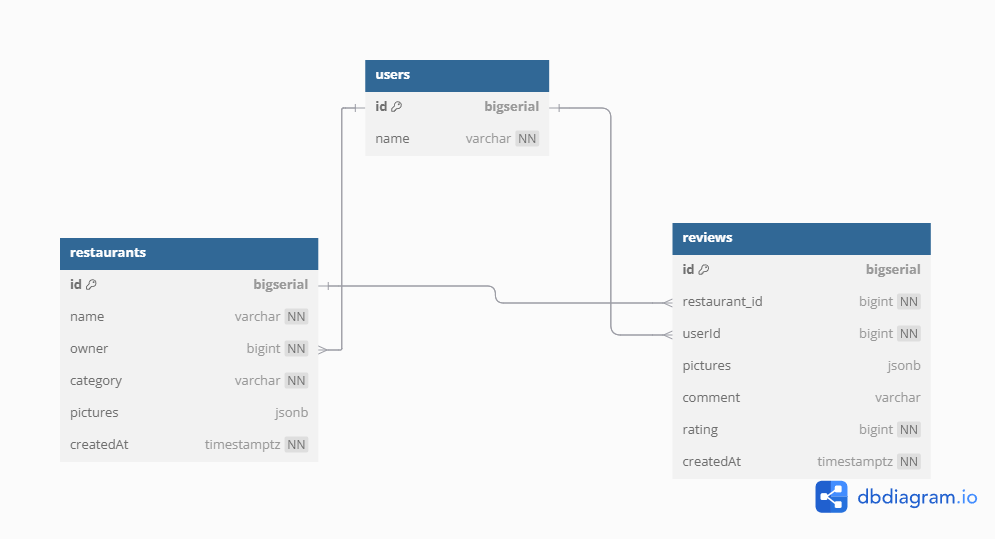

# BestFoody API

BestFoody API provides a set of RESTful endpoints for managing restaurants and reviews. This API allows creating, retrieving, updating, and deleting restaurant entries and reviews. It also supports filtering, sorting, and pagination for efficient data access.

For pagination, the default will always be `page = 1` and `limit = 10`.

For sorting, a request query `orderBy` is used. For example, `rating_desc` will sort results from highest to lowest rating. If there is a typo such as `rating_anything_else`, it will sort by ascending order. The reason for handling invalid sorting directions (e.g., `rating_adasdasd`) by defaulting to ascending (`1`) is to ensure that the API always returns data, even if there's a typo or incorrect value in the `orderBy` parameter. This approach prevents errors from breaking the request and guarantees that the user still receives results, even if not sorted as intended. This ensures a more resilient user experience where the system gracefully handles unexpected input.

MongoDB was chosen for its flexibility in handling dynamic and nested data, making it ideal for storing restaurant reviews with optional fields like images, ratings, and comments without a schema and also data type like an array of objects like pictures.

## 🔐 Security

- **Helmet**: Sets secure HTTP headers to protect against common vulnerabilities like XSS, clickjacking, and MIME-type sniffing.
- **CORS**: Restricts which external domains can access the API, helping prevent unauthorized cross-origin requests.
- **Authentication**: Currently uses JWT (see section below).
- **Authorization**: Role-based access control planned — will determine which endpoints a user can access based on `req.user.role`. (FUTURE PLANS)
- **Rate Limiting**: Limits the number of requests from a single IP within a specific timeframe to protect the API from abuse and DDoS attacks. (FUTURE PLANS)

## Authentication

For authentication, there is a middleware that uses JWT to verify users. However, as this project does not focus on user management, a dummy user is created globally.
A constant token `bestfoodydev` is used to simulate authentication. If you include this token in the request header, the middleware will set `req.user` to the `dummyUser`. This is done to simplify development and to skip the middleware validation. In a real production environment, there should be a JWT token payload with similar attributes to the `dummyUser`.

### Example Header:

```http
Authorization: Bearer bestfoodydev
```

### Dummy User

```javascript
global.dummyUser = {
  _id: "67f3d7983ff6240012661eef",
  name: "testUser",
  role: "user",
};
```

## Database R&D ERD



## Instructions

### Requirements

- **Docker** must be installed.
- **Postman** to run the queries.

---

### Setup

1. **Clone the repository:**

```sh
git clone https://github.com/devHens/bestfoody_2.git
```

2. **Navigate into the project directory:**

```sh
cd bestfoody_2
```

3. **Create a `.env` file in the root of the repository with the following content:**

```
MONGO_URI=mongodb://bestfoody_mongodb:27017/bestfoody
PORT=3000
JWT_SECRET=your_jwt_secret_here
```

- Replace `your_jwt_secret_here` or use the one that I send to HR.

4. **Start the application with sample data:**

```sh
make start-app
```

5. **Import the Postman Collection:**

   - Import the `BestFoody.postman_collection.json` file from the repository into Postman to test the API endpoints.

6. **Shut down all containers:**

```sh
make down-app
```

## Makefile Commands

A Makefile is provided to simplify common tasks. Below are the available commands:

- **start-container**: Starts the necessary Docker containers for the application.
- **down-app**: Stops and removes all Docker containers related to the application.
- **start-app**: Combines `start-container` and `seed` commands to initialize the application and populate the database.
- **seed**: Populates the database with the sample data listed below and remove the old ones.

.PHONY targets used: `seed-restaurants`, `start-app`, `down-app`

### PLEASE TAKE NOTE

For endpoints that require path IDs such as `restaurantId` or `reviewId`, you must retrieve the relevant `_id` through `GET` requests before performing operations like `PUT`, `DELETE`

- **For Reviews:**

  - To update or delete a review, retrieve both `reviewId` and `restaurantId` by making a `GET` request to **Get Restaurant Reviews** (`/restaurants/:restaurantId/review`).

  - To create a review you have to retrieve the `restaurantId` by making a `GET` request to **Get Restaurants** (`/restaurants`).

- **For Restaurants:**
  - To update, delete, or retrieve a single restaurant, retrieve the `restaurantId` by making a `GET` request to **Get Restaurants** (`/restaurants`).

Always ensure you have the correct IDs before attempting operations that require them.

## Base URL

```
localhost:3000/api/v1
```

## Endpoints

### Restaurants

- **Get Restaurants** (GET)

  - URL: `/restaurants`
  - Query Parameters:
    - `category`, `name`, `orderBy`, `hasPicture`, `averageRating`, `limit`, `page`
      orderBy only can be work for - name,averageRating,createdAt
  - Description: Retrieves a list of restaurants with optional filtering, sorting, and pagination. Returns 3 of the latest reviews as well. Filtering of name and category uses a regex and incase sensitive so if u are filtering for Category- Chi it will show all the results of chi (such as Chinese)\*

- **Create Restaurant** (POST)

  - URL: `/restaurants`
  - Body:
    - `name` (required)
    - `category` (required)
    - `images` (optional) - URLs or files (max 5)
  - Description: Creates a new restaurant entry.

- **Update Restaurant** (PUT)

  - URL: `/restaurants/:id`
  - Body:
    - `name`, `category`, `pictures`
  - Description: Updates an existing restaurant by ID. Replaces the entire object. Please note that this is a PUT request. When an update occurs, it will replace the entire object rather than just modifying one property.

- **Delete Restaurant** (DELETE)

  - URL: `/restaurants/:id`
  - Description: Deletes an existing restaurant by ID.

- **Get Single Restaurant** (GET)

  - URL: `/restaurants/:id`
  - Query Parameters: `limit`, `page`, `orderBy`, `rating`
    order by only for createdAt and rating

  - Description: Retrieves restaurant details and reviews with optional filtering and sorting.

---

### Reviews

- **Create Review** (POST)

  - URL: `/restaurants/:restaurantId/review`
  - Body:
    - `rating` (1-5, required)
    - `comment` (optional)
    - `images` (optional)
  - Description: Adds a review to a restaurant.

- **Get Restaurant Reviews** (GET)

  - URL: `/restaurants/:restaurantId/review`
  - Query Parameters: `orderBy`, `page`, `limit`, `rating`
    order by only for createdAt and rating
  - Description: Retrieves all reviews for a specific restaurant.

- **Update Review** (PUT)

  - URL: `/restaurants/:restaurantId/review/:reviewId`
  - Body:
    - `rating`, `comment`
  - Description: Updates a review. Only allowed within 15 minutes of creation. Please note that this is a PUT request. When an update occurs, it will replace the entire object rather than just modifying one property.

- **Delete Review** (DELETE)
  - URL: `/restaurants/:restaurantId/review/:reviewId`
  - Description: Deletes a review. Only the owner of the restaurant or the review can delete it.

---

## Sample Data

This application uses sample data to populate the database with restaurants and their corresponding reviews. The data is structured to include a list of restaurants, each having its own category, owner, pictures, and associated reviews.

### Sample Restaurants

- **Shake Shack** (Category: Fast Food, Owner: testUser)

  - Pictures: `shakeshack1.jpg`
  - Reviews:
    - Rating: 4, Comment: "Tasty burgers!", Pictures: `shake1.jpg`
    - Rating: 5, Comment: "Loved the fries!", Pictures: `fries.jpg`

- **KFC** (Category: Fast Food, Owner: testUser)

  - Pictures: `kfc1.jpg`
  - Reviews:
    - Rating: 3, Comment: "Chicken was too salty.", Pictures: `kfc.jpg`

- **McDonald's** (Category: Fast Food, Owner: testUser)

  - Pictures: `mcdonalds1.jpg`
  - Reviews:
    - Rating: 4, Comment: "Fast service!", Pictures: `mcdonalds.jpg`

- **Olive Garden** (Category: Italian, Owner: testUser)

  - Pictures: `olivegarden1.jpg`
  - Reviews:
    - Rating: 5, Comment: "Pasta was amazing!", Pictures: `pasta.jpg`

- **Pizza Hut** (Category: Italian, Owner: testUser)

  - Pictures: `pizzahut1.jpg`
  - Reviews:
    - Rating: 4, Comment: "Good pizza but crust was hard.", Pictures: `pizza.jpg`

- **Din Tai Fung** (Category: Chinese, Owner: testUser)

  - Pictures: `dintaifung1.jpg`
  - Reviews:
    - Rating: 5, Comment: "Best dumplings I've ever had!", Pictures: `dumplings.jpg`

### Purpose

Seed it into database so will have sample data to query.
The owner of all restaurants is named `testUser`, userId and owner `67f3d7983ff6240012661eef` is for simplicity.
